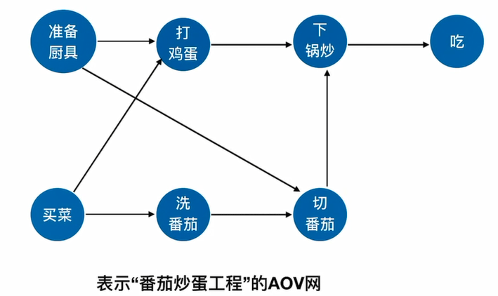
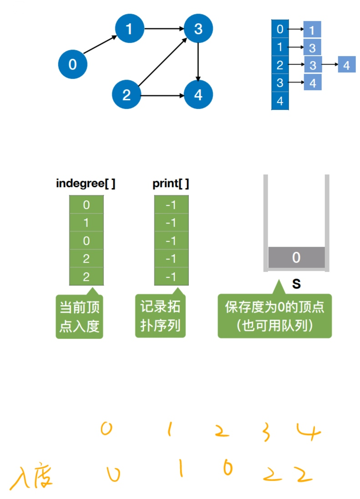

## 拓扑排序

### 一、AOV网

`AOV网`（Activity On Vertex NetWork，用`顶点表示活动`的网）：
用DAG图（`有向无环图`）表示一个工程。
`顶点表示活动`，边$$<V_i,V_j>$$表示活动$$V_i$$必须先于活动$$V_j$$进行



### 二、拓扑排序

有向无环图中当且仅当满足下列条件时，称为该图的一个拓扑排序：
①每个顶点出现且只出现一次
②若顶点A在序列中排在B的前面，则在图中不存在从B到A的路径

每个AOV网有多个拓扑排序序列。

`拓扑排序：找到做事的先后顺序。`

拓扑排序的实现：
①从AOV网中选择一个没有前驱（入度为0）的顶点并输出。
② 从网中删除该顶点和所有以它为起点的有向边。
③ 重复①和②直到当前的AOV网为空或当前网中不存在无前驱的顶点为止。

#### 图的类型描述：


```c
#define MaxVertexNum 100       //顶点数目最大值
//"边（弧）"
typedef struct ArcNode{
    int adjvex;                //边（弧）指向那个结点
    struct ArcNode *next;      //指向下一条弧的指针
    //InfoType info;           //边权值
}ArcNode;
//"顶点"
typedef struct VNode{
    VertexType data;           //顶点数据
    ArcNode *first;            //顶点指向的第一条边
}VNode, AdjList[MaxVertexNum];
//用领接表存储图
typedef struct{
    AdjList vertices;          //顶点数组
    int vernum, arcnum;        ////图当前的顶点数和边数（弧数）
}ALGraph;
```

### 代码

```c
bool TopologicalSort(Graph G){
    InitStack(S);            //初始化栈，存储入度为0的顶点
    for(int i=0; i<G.vexnum; i++){
        if(indegree[i] == 0){
            Push(S,i);       //将所有入度为0的顶点进栈
        }
    }
    int count = 0；          //计数，记录当前已经输出的顶点数
	while(!IsEmpty(S)){      //栈不空，则存在入度为0的顶点
        Pop(S,i);            //栈顶元素出栈
        print[count++] = i;    //输出顶点i
        for(p=G.vertices[i].firstarc; p; p=p->nextarc){//p是顶点第一个指向的结点，p存在则循环
            //将所有i指向的顶点的入度减1，并且将入度减为0的顶点压入栈s
            v = p->adjvex;     //v是结点p中存的顶点号
            if(!(--indegree[v]))   //入度先减1，再判断是否为0
                Push(S,v);   //入度为0，则入栈
        }
    }
    if(count < G.vexnum)
        return false;    //排序失败，有向图中有回路
    else
        return true;     //拓扑排序成功
}
```




