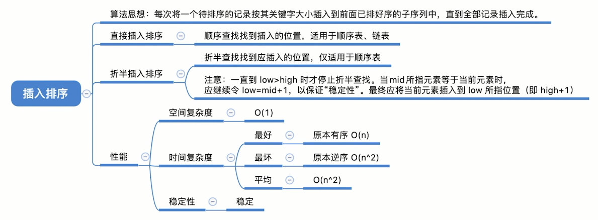

## 插入排序——Insertion Sort



### 一、算法思想：

每次将一个待排序的记录按其关键字大小插入到前面已排好序的子序列中，直到全部记录插入完成。


### 二、代码实现：

普通：

```c
// 直接插入排序
void InsertSort(int A[], int n){
    int i, j, temp;
    for(i=1; i<n; i++){         //讲个元素插入已排好的序列中
        if(A[i]<A[i-1]){        //若A[i]的关键字小于前驱
            temp = A[i];        //用temp暂存A[i]
            for(j=i-1; i>=0 && A[j]<temp; --j){ //检查所有前面已排好序的元素
                A[j+1] = A[j];  //所有大于temp的都后移
            }
            A[j+1] = temp;      //复制到插入位置
        }
    }
}
```

带哨兵：

```c
// 直接插入排序（带哨兵）
void InsertSort(int A[], int n){
    int i, j;
    for(i=2; i<=n; i++){         //讲个元素插入已排好的序列中
        if(A[i]<A[i-1]){        //若A[i]的关键字小于前驱
            A[0] = A[i];        //复制为哨兵，A[0]作为哨兵
            for(j=i-1; A[0]<A[j]; --j){ //从后往前查找待插入位置
                A[j+1] = A[j];  //所有大于A[0]的都后移
            }
            A[j+1] = A[0];      //复制到插入位置
        }
    }
}
```

### 三、算法效率分析

`空间复杂度`=$$O(1)$$，因为需要的辅助变量为int i，j，temp，

时间复杂度:
最好情况=$$n-1$$，时间复杂度=$$O(n)$$
最坏情况=$$2+3+\cdots+n+(n+1)=\frac{n(n+3)}{2}$$，时间复杂度=$$O(n^2)$$
平均`时间复杂度`=$$O(n^2)$$

算法稳定性：`稳定`

### 四、优化——折半插入排序

折半查找找出插入的位置

当A[mid]=A[0]时，将[mid，i-1]内的元素全部后移，并将A[0]复制到mid所在位置。

Low>high时停止，将[low，i-1]内的元素全部后移，并将A[0]复制到low所在位置。

带哨兵：

```c
// 直接插入排序（带哨兵）
void InsertSort(int A[], int n){
    int i, j, low，high，mid;
    for(i=2; i<=n; i++){         //讲个元素插入已排好的序列中
        if(A[i]<A[i-1]){        //若A[i]的关键字小于前驱
            A[0] = A[i];        //复制为哨兵，A[0]作为哨兵
            low = 1;
            high = i-1;
            while(low <= high){
                mid = (low+high)/2;
                if(A[mid] > A[0]) high = mid - 1;
                else low = mid + 1;
            }
            for(j=i-1; j>high+1; --j){ //从后往前查找待插入位置
                A[j+1] = A[j];  //所有大于A[0]的都后移
            }
            A[high+1] = A[0];      //复制到插入位置
        }
    }
}
```

 虽然对比关键字次数变少，但时间复杂度的数量级依然没变。

`时间复杂度`=$$O(n^2)$$
