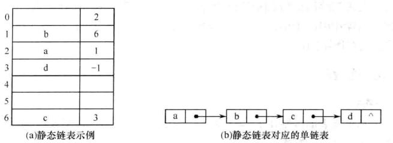

# 1. 线性表

## 1.1 线性表的定义和基本操作

#### 定义

线性表是具有**相同数据类型**的 n 个数据元素的**有限序列**。其中 n 为表长，当 n=0 时线性表是一个空表。若用 L 命名线性表，则其一般表示为 $L=(a_1,a_2,...,a_i,a_{i+1},...,a_n)$。

#### 特点

* $a_1$​是唯一的 “第一个” 数据元素，又称表头元素
* $a_n$​是唯一的 “最后一个” 数据元素，又称表尾元素
* 除第一个元素外，每个元素有且仅有一个直接前驱。除最后一个元素外，每个元素有且仅有一个直接后继。

#### 基本操作

```c
InitList(&L);     //初始化表：构造一个空的线性表L，分配内存空间
DestoryList(&L);  //销毁操作：销毁线性表，并释放线性表L所占用的内存空间

ListInsert(&L,i,e);  //插入操作：在表L中第i个位置上查入指定元素e
ListDelete(&L,i,&e); //删除操作：删除表L中第i个位置的元素，/*并用e反回删除元素的值*/

LocateElem(L,e); //按值查找操作
GetElem(L,i);    //按位查找操作

//其它常用操作
Length(L);  //求表长
Print(L);   //输出操作
Empty(L);   //判空操作
```

## 1.2线性表的顺序表示

### 顺序表的定义

线性表的顺序存储又称顺序表。它是用一组地址连续的存储单元依次存储线性表中的数据元素，从而使得逻辑上相邻的两个元素在物理位置上也相邻。顺序表的特点是表中元素的逻辑顺序与物理顺序相同。

* 线性表 A 中第`i`个元素的内存地址：`&(A[0])+i*sizeof(ElemType)`
* 一维数组可以是静态分配，也可以动态分配
* 静态分配时，数组的大小和空间事先已经固定，一旦空间占满，再加入新的数据就会产生溢出，进而导致程序崩溃
* 动态分配时，存储数组的空间是在程序执行过程中通过动态存储分配语句分配的，一旦数据空间占满，就另外开辟一块更大的存储空间，用以替换原来的存储空间。

**静态分配的实现**

```c
#define MaxSize 50                //定义线性表的最大长度
typedef struct{
    ElemType data[MaxSize];        //顺序表的元素
    int length;                    //顺序表的当前长度
}SqList;                        //顺序表的类型定义
```

**动态分配的实现**

```c
#define InitSize 100            //表长度的初始定义
typedef struct{                
    ElemType *data;                //指示动态分配数组的指针
    int MaxSize,length;            //数组的最大容量和当前个数
}SqList;                        //动态分配数组顺序表的类型定义
//C的初始动态分配语句
L.data = (ElemType*)malloc(sizeof(ElemType)*InitSize);
free(L);

//C++的初始动态分配语句
L.data = new ElemType[InitSize];
delete L;
```

#### 特点

* 随机访问
* 存储密度高
* 插入删除需要移动大量元素

### 顺序表的实现

`注意算法对i的描述是第i个元素，它是以1为起点的`

#### 插入

```c
//插入操作：在顺序表L的第i个(位序)上插入x
bool ListInsert(SqList &L, int i,int e){
    if(i<1||i>L.length+1)		//判断i的范围是否有效
        return false;
    if(L.length>=MaxSize)		//当存储空间已满时，不能插入
        return false;
    for(int j=L.length; j>=i; j--)
        L.data[j]=L.data[j-1];  //将第i个及后面的元素后移
    L.data[i-1]=e;				//将e放到第i个位置
    L.length++;                 //长度+1
}
```

##### 插入的时间复杂度：

最好情况：插到表尾，不需移动元素，循环0次，`最好时间复杂度`=O(1)

最坏情况：插到表头，移动n个元素，循环n次，`最坏时间复杂度`=O(n)

平均情况：设插入概率为p=1/n+1，则循环np+(n-1)p+…+1p=n/2，`平均时间复杂度`=O(n)

#### 删除

```c
//删除操作：删除顺序表L中第i个元素并返回其元素值
bool ListDelete(SqList &L, int i,int &e){
    if(i<1||i>L.length+1){		       //判断i的范围是否有效
        return false;
    }else{
        e = L.data[i-1];               //将被删除的元素赋值给e
        for(int j=i; j<L.length; j++){
            L.data[j]=L.data[j-1];     //将第i个后面的元素前移
        }
    	L.length--;                    //长度-1
        return ture;
    }
}
```

##### 删除的时间复杂度：

最好情况：删除表尾，不需移动元素，循环0次，`最好时间复杂度`=O(1)

最坏情况：删除表头，移动n-1个元素，循环n次，`最坏时间复杂度`=O(n)

平均情况：设删除概率为p=1/n，则循环(n-1)p+(n-2)p+…+1p=(n-1)/2，`平均时间复杂度`=O(n)

#### 查找

##### 按位查找

```c
//按位查找：返回顺序表中第i个元素的元素值
int GetElem(Sqlist L, int i){
    return L.data[i-1];
}
```

###### 按位查找的时间复杂度

时间复杂度=O(1)

##### 按值查找

```c
//按值查找：返回顺序表L中第一个值为x的元素的位置
int LocateElem(Sqlist L, int e){
    for(int i=0; i<L.length; i++){
        if(L.data[i] == e)
            return i+1;  //返回元素位置
    }
    return -1;  //查找失败，返回-1
}
```

###### 按值查找的时间复杂度

最好情况：目标在表头，循环1次，`最好时间复杂度`=O(1)

最坏情况：目标在表尾，循环n次，`最坏时间复杂度`=O(n)

平均情况：设删除概率为p=1/n，则循环(n-1)p+(n-2)p+…+1p=(n+1)/2，`平均时间复杂度`=O(n)


## 1.3 线性表的链式表示

### 单链表

* 结点描述：

```c
typedef struct LNode{        //定义单链表结点类型
    ElemType data;            //数据域
    struct LNode *next;        //指针域
}LNode, *LinkList;        //LinkList为指向结构体LNODE的指针类型
```

* 通常用头指针来标示一个单链表。
* 有头结点或者没头结点之分
* 头结点的作用
  * 便于首元结点的处理，对链表的第一个数据元素的操作与其他数据元素相同，无需特殊处理
  * 便于空表与非空表的统一处理：头指针永远不为空

### 单链表的实现


```c
LinkList List_HeadInsert(LinkList &L){
    LNode *s;int x;
    L=(LinkList)malloc(sizeof(LNode));//创建头结点
    L->next = NULL;                    //初始为空链表
    scanf("%d",&x);
    while(x!=9999){
        s = (LNode*)malloc(sizeof(LNode));
        s->data = x;
        s->next = L->next;
        L->next = s;
        scanf("%d",&x);
    }
    return L;
}
```


```c
LinkList List_TailInsert(LinkList &L){
    int x;
    L = (LinkList)malloc(sizeof(LNode));
    LNode *s,*r=L;            //r为表尾指针
    scanf("%d",&x);
    while(x!=9999){
        s = (LNode *)malloc(sizeof(LNode));
        s->data = x;
        r->next = s;
        r = s;
        scanf("%d",&x);
    }
    r->next = NULL;                //尾结点指针置空
    return L;
}
```

```c
LNode *LocateElem(LinkList L,ElemType e){//按值查找
    LNode *p = L->next;
    while(p!=NULL&&p->data!=e)
        p = p->next;
    return p;
}
```

#### 删除

##### 按位序删除

```c
//删除操作:将单链表中的第i个结点删除
bool Delete(LinkList &L, int i int &e){
    if(i<1 || i>Length(L))
        return false;
    LNode *p = GetElem(L,i-1);  //查找第i个位置
    LNode *q = p->next;
    e = q->data;
    p->next = q->next;
    free(q);
    return true;
}
```

###### 按位序删除的时间复杂度：

最好情况：删除第一个，不需查找位置，循环0次，`最好时间复杂度`=O(1)

最坏情况：删除最后一个，需查找第n位，循环n次，`最坏时间复杂度`=O(n)

平均情况：删除任意一个，`平均时间复杂度`=O(n)

##### 指定结点的删除

`时间复杂度`=O(n)

方法：p的后一个为q，p指向q的下一个，把q的值给p，最后释放q

```c
//删除指定结点p
bool Delete(LNode *p){
    if(p==NULL) return false;
    LNode *q = p->next;
    p->data = q->data
    p->next = q->next;
    free(q);
    return true;
}
```

#### 查找

##### 按位查找

`平均时间复杂度`=O(n)

```c
//按位查找：查找在单链表L中第i个位置的结点
LNode *GetElem(LinkList L, int i){
    int j=0;
    LNode *p = L;
    if(i<0) return NULL;
    while(p && j<i){
        p = p->next;
        j++;
    }
    return p; //如果i大于表长，p=NULL,直接返回p即可
}
```

##### 按值查找

`平均时间复杂度`=O(n)

```c
//按值查找：查找e在L中的位置
LNode *LocateElem(LinkList L, int e){
    LNode *p = L->next;
    while(p && p->data != e){
        p = p->next;
    }
    return p;
}
```

#### 求表长

`平均时间复杂度`=O(n)

```c
//求表的长度
int Length(LinkList L){
    int len = 0;
    LNode *p = L;
    while(P->next){
        p = p->next;
        len++;
    }
    return len;
}
```

#### 遍历

```c
//遍历操作
void PrintList(LinkList L){
    LNode *p = L->next;
    while(p){
        printf("%d ", p->data);
        p = p->next;
    }
}
```

### 双链表

```c
typedef struct DNode{
    ElemType data;
    struct DNode *prior,*next;    //前驱和后继指针
}DNode,*DLinkList;
```

### 循环链表

* 循环单链表

初始化和判空(与单链表不一样)
`L->next = NULL改为L->next = L`

* 循环双链表

初始化和判空(与双链表不一样)
```c
L->next = NULL改为L->next = L
L->prior = NULL改为L->prior = L
```

### 静态链表

借助数组来描述线性表的链式存储结构，结点也有数据域`data`和指针域`next`，这里的指针是节点的相对地址（数组下标），又称**游标**

```c
#define MaxSize 50
typedef struct{
    ElemType data;
    int next;
}SLinkList[MaxSize];
```