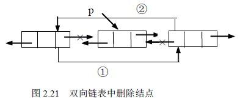

## 1.4 双链表

### 1.4.1 单链表的定义

单链表的结点中只有一个指向其后继的指针，使得单链表要访问某个结点的前驱结点时，只能从头开始遍历，访问后驱结点的复杂度为O(1)，访问前驱结点的复杂度为O(n)。为了克服上述缺点，引入了双链表。

 `双链表`的结点中有两个指针`prior`和`next`，分别指向前驱结点和后继结点。

### 1.4.2 双链表的实现方式

实现方式：`不带头结点`和`带头结点`，一般带头结点比不带头结点好

带头结点：写操作代码方便，一般用带头结点，不明确的都是带头结点的

不带头结点：写操作代码麻烦，要区分第一个数据和后续数据的处理

### 1.4.3 双链表上的操作（带头结点）

#### 双链表的类型描述

```C
typedef struct DNode{
    int data;  //数据域
    struct DNode *prior,*next;  //前驱和后继指针
}DNode, *DLinkList;
```

#### 初始化


```c
//初始化
bool InitList(DLinkList &L){
    L = (LNode *)malloc(sizeof(DLinkList));
    if(L == NULL) return false;
    L->prior = NULL;
    L->next = NULL;
    return true;
}
```

#### 判空

```c
//判空操作
bool Empty(DLinkList L){
    if(L->next == NULL){
        return true;
    }else{
        return false;
    }
}
```

#### 建立双链表

##### 头插法建立双链表

用于链表的逆置

```c
//头插法建立双链表
DLinkList HeadInsert(DLinkList &L){
    InitList(L); //初始化
    int x;
    cin>>x;
    while(x!=9999){
        DNode *s = (DNode *)malloc(sizeof(DNode));
        s->data = x;
        if(L->next == NULL){
            s->next = NULL;
            s->prior = L;
            L->next = s;
        }else{
            s->next = L->next;
            L->next->prior = s;
            s->prior = L;
            L->next = s;
        }
        cin>>x;
    }
    return L;
}
```

##### 尾插法建立单链表

```c
//尾插法建立双链表
DLinkList TailInsert(DLinkList &L){
    InitList(L);
    DNode *s,*r=L;
    int x;
    cin>>x;/// 相当于scanf
    while(x!=9999){
        s = (DNode *)malloc(sizeof(DNode));
        s->data = x;
        s->next = NULL;
        s->prior = r;
        r->next = s;
        r = s;
        cin>>x;/// 相当于scanf
    }
    return L;
}
```

#### 插入

`时间复杂度`=O(1)


```c
//将x插入到双链表L中*p结点的下一个结点
bool Insert(DNode *p, int x){
    DNode *s = (DNode *)malloc(sizeof(DNode));
    if(p == NULL||s==NULL) return false;
    s->data = x;
    s->next = p->next;  //1
    if(p->next != NULL) p->next->prior = s; //2
    s->prior = p;  //3
    p->next = s; //4
    return true;
}

//在双链表L中*p结点后插入s结点
bool Insert(DNode *p, DNode *s){
    if(p == NULL||s==NULL) return false;
    s->next = p->next;  //1
    if(p->next != NULL) p->next->prior = s; //2
    s->prior = p;  //3
    p->next = s; //4
    return true;
}
```

#### 删除

##### 按位序删除

`时间复杂度`=O(n)



```c
//删除操作:将双链表中的第i个结点删除
bool Delete(DLinkList &L, int i){
    if(i<1 || i>Length(L)) return false;
    DNode *p = GetElem(L,i-1);
    if(p == NULL) return false;
    DNode *q = p->next;
    p->next = q->next; //1
    if(p->next != NULL) q->next->prior = p; //2
    free(q);
    return true;
}
```

##### 指定结点的删除

`时间复杂度`=O(1)

```c
//删除操作:删除双链表中的p结点的后继结点
void DeleteNextNode(DNode *p){
    if(p == NULL) return false;
    DNode *q = p->next;
    if(q == NULL) return false;
    p->next = q->next; //1
    if(p->next != NULL) q->next->prior = p; //2
    free(q);
}
```

#### 查找(与单链表完全一样)

##### 按位查找

`平均时间复杂度`=O(n)

```c
//按位查找：查找在单链表L中第i个位置的结点
DNode *GetElem(DLinkList L, int i){
    int j=0;
    DNode *p = L;
    if(i<0) return NULL;
    while(p && j<i){
        p = p->next;
        j++;
    }
    return p; //如果i大于表长，p=NULL,直接返回p即可
}
```

##### 按值查找

`平均时间复杂度`=O(n)

```c
//按值查找：查找e在L中的位置
DNode *LocateElem(DLinkList L, int e){
    DNode *p = L->next;
    while(p && p->data != e){
        p = p->next;
    }
    return p;
}
```

#### 求表长(与单链表完全一样)

`平均时间复杂度`=O(n)

```c
//求表的长度
int Length(DLinkList L){
    int len = 0;
    DNode *p = L;
    while(P->next){
        p = p->next;
        len++;
    }
    return len;
}
```

#### 遍历(与单链表完全一样)

```c
//遍历操作
void PrintList(DLinkList L){
    DNode *p = L->next;
    while(p){
        cout<<p->data<<" ";
        p = p->next;
    }
    cout<<endl;
}
```

#### 销毁

```c
//销毁操作
void DestoryList(DLinkList L){
    //循环释放各点的数据结点
    while(L->next != NULL){
        DeleteNextNode(L);
    }
    free(L); //释放头结点
    L = NULL;
}
```

### 1.4.4 完整代码

```c
#include<bits/stdc++.h>
using namespace std;

typedef struct DNode{
    int data;
    struct DNode *prior,*next;
}DNode, *DLinkList;

//初始化
void InitList(DLinkList &L){
    L = (DNode *)malloc(sizeof(DLinkList));
    L->prior = NULL;
    L->next = NULL;
}

//遍历操作
void PrintList(DLinkList L){
    DNode *p = L->next;
    while(p){
        cout<<p->data<<" ";
        p = p->next;
    }
    cout<<endl;
}

//求双链表的长度
int Length(DLinkList L){
    DNode *p = L->next;
    int len = 0;
    while(p){
        len++;
        p = p->next;
    }
    return len;
}

//头插法建立双链表
DLinkList HeadInsert(DLinkList &L){
    InitList(L); //初始化
    int x;
    cin>>x;
    while(x!=9999){
        DNode *s = (DNode *)malloc(sizeof(DNode));
        s->data = x;
        if(L->next == NULL){
            s->next = NULL;
            s->prior = L;
            L->next = s;
        }else{
            s->next = L->next;
            L->next->prior = s;
            s->prior = L;
            L->next = s;
        }
        cin>>x;
    }
    return L;
}

//尾插法建立双链表
DLinkList TailInsert(DLinkList &L){
    InitList(L);
    DNode *s,*r=L;
    int x;
    cin>>x;
    while(x!=9999){
        s = (DNode *)malloc(sizeof(DNode));
        s->data = x;
        s->next = NULL;
        s->prior = r;
        r->next = s;
        r = s;
        cin>>x;
    }
    return L;
}

//按值查找：查找x在L中的位置
DNode *LocateElem(DLinkList L, int x){
    DNode *p = L->next;
    while(p && p->data != x){
        p = p->next;
    }
    return p;
}

//按位查找：查找在双链表L中第i个位置的结点
DNode *GetElem(DLinkList L, int i){
    int j=1;
    DNode *p = L->next;
    if(i==0)return L;
    if(i<1)return NULL;
    while(p && j<i){
        p = p->next;
        j++;
    }
    return p; //如果i大于表长，p=NULL,直接返回p即可
}

//将x插入到双链表L中*p结点的下一个结点
void Insert(DLinkList &L, DNode *p, int x){
    DNode *s = (DNode *)malloc(sizeof(DNode));
    s->data = x;
    s->next = p->next;
    p->next->prior = s;
    s->prior = p;
    p->next = s;
}

//删除操作:将双链表中的第i个结点删除
void Delete(DLinkList &L, int i){
    if(i<1 || i>Length(L)){
        cout<<"delete failed: index is wrong."<<endl;
        return;
    }
    DNode *p = GetElem(L,i-1);
    DNode *q = p->next;
    p->next = q->next;
    q->next->prior = p;
    free(q);
}

//判空操作
bool Empty(DLinkList L){
    if(L->next == NULL){
        cout<<"L is null"<<endl;
        return true;
    }else{
        cout<<"L is not null"<<endl;
        return false;
    }
}


int main(){
    //尾插法建立双链表，并遍历单链表
    DLinkList L = TailInsert(L);
    cout<<"L: ";
    PrintList(L);
    
    DNode *p;
    //按值查找
    p = LocateElem(L,2);
    cout<<"值为2的结点的下一个结点值是："<<p->next->data<<endl;
    cout<<"值为2的结点的上一个结点值是："<<p->prior->data<<endl;
    //按位查找
    p = GetElem(L,3);
    cout<<"第三个结点值是："<<p->data<<endl;
    
    //插入操作
    Insert(L,p,7);
    cout<<"在第三个结点后面插入值为7的结点后L： ";
    PrintList(L);
    
    //删除操作
    Delete(L, 5);
    cout<<"删除第五个结点后L： ";
    PrintList(L);
    
    //求表长
    cout<<"表长为："<<Length(L)<<endl;;
    
    //判空
    Empty(L);
    return 0;
}
```

#### 运行结果：


