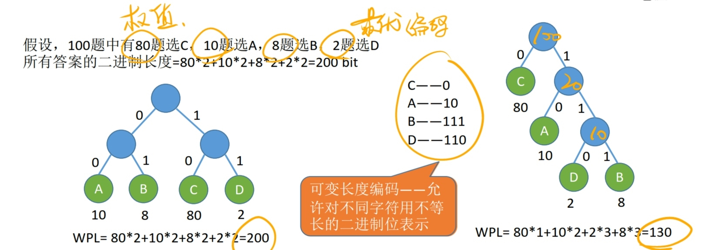

## 哈夫曼树——Huffman Tree

### 一、带权路径长度

结点的`权`：有某种现实含义的数值（如：结点的重要性等）

`结点的带权路径长度=该结点的路径长度×该结点的权值`

`树的带权路径长度`=所有`叶结点`的`带权路径长度之和`

### 二、哈夫曼树的定义

给定N个权值作为N个叶子结点，构造一棵二叉树，若该树的`带权路径长度达到最小`，称这样的二叉树为`最优二叉树`，也称为`哈夫曼树`(Huffman Tree)。

哈夫曼树是带权路径长度最短的树，权值较大的结点离根较近。

### 三、哈夫曼树的构造

哈夫曼树构造的树可以不同，但带权路径长度相同

### 四、哈夫曼编码

①固定长度编码：平衡二叉树

②可变长度编码：哈夫曼树（最优二叉树）

