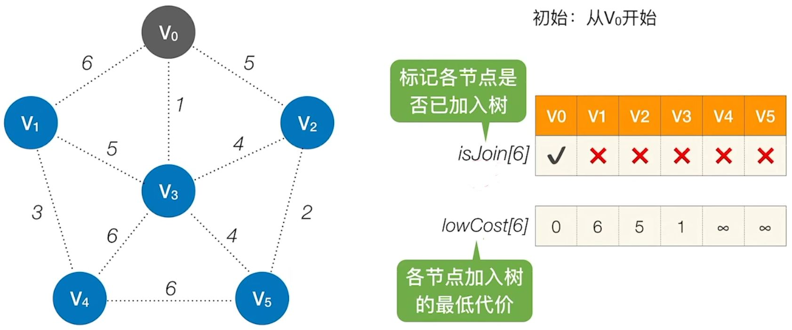
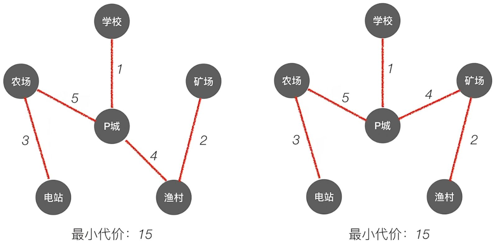
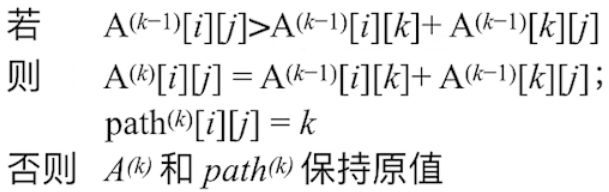
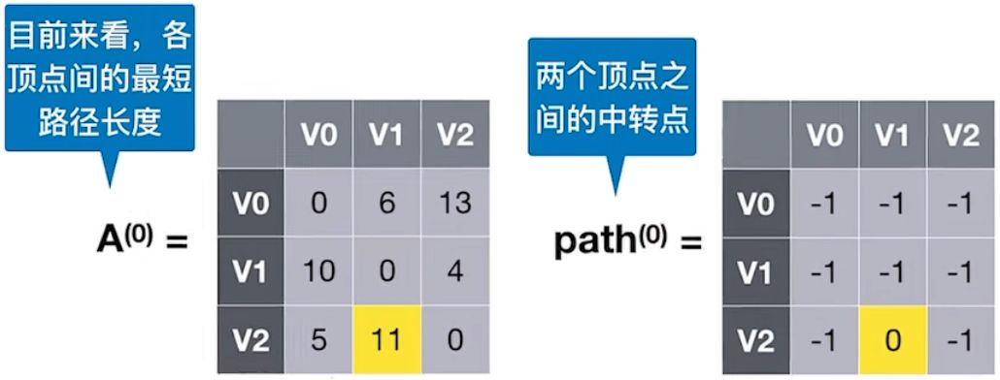
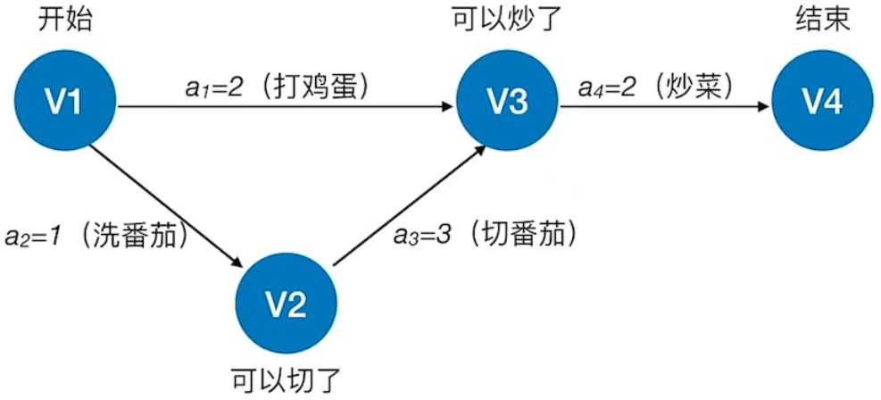
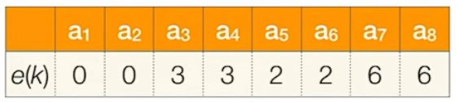

# 5. 图

## 5.1 图的基本概念

### 5.1.1 图的定义

图 $G$由顶点集 $V$和边集 $E$组成，记为 
$G=(V,E)$, 其中 $V(G)$表示图 $G$中顶点的有限非空集； $E(G)$表示图 $G$中顶点之间的关系[集合](https://so.csdn.net/so/search?q=%E9%9B%86%E5%90%88&spm=1001.2101.3001.7020)。

- $V=\{v_1,v_2,...,v_n\}$, $|V|$表示顶点个数
- $E=\{(u,v)|u \in V,v\in V\}$, $|E|$表示图 $G$ 中边的条数

### 5.1.2 基本术语


* 有向图
* 无向图
* 简单图、多重图
* 完全图
* 子图
* 连通、连通图和连通分量
* 强连通图、强连通分量
* 生成树、生成森林
* 顶点的度、入度和出度
* 边的权和网
* 稠密图、稀疏图
* 路径、路径长度和回路
* 简单路径、简单回路
* 距离
* 有向树

## 5.2 图的存储及基本操作


* 必须完整、准确地反映顶点集合边集的信息

### 5.2.1 邻接矩阵法


* 一个一维数组存储图中顶点的信息
* 一个二维数组存储图中边的信息，称为**邻接矩阵**
* 设图 $G$的邻接矩阵为 $A$, $A^n$ 的元素等于从顶点 i 到 j 的长度为 n 的路径数目

### 5.2.2 邻接表法


* 顶点表结点
  
边表的头指针和顶点的数据信息采用顺序存储

顶点域	| 边表头指针
--------|----------
`data`	| `firstarc`

* 边表结点
  
  对每个顶点 $v_i$​建立一个单链表，第 $i$个单链表中的结点表示依附于顶点 $v_i$​的边，这个单链表为顶点 $v_i$​的**边表**

邻接点域 |	指针域 
--------|----------
`adjvex`	| `nextarc`


* 若存储的是无向图, 空间复杂度为 $O(|V|+2|E|)$；若为有向图，空间复杂度为 $O(|V|+|E|)$

### 5.2.3 十字链表

* 有向图的一种链式存储结构
* 对应于有向图中的每条弧有一个结点，对应于每个顶点也有一个结点


* 弧结点

尾域 | 头域	| 链域->弧头相同的下一条弧|	链域->弧尾相同的下一条弧	| 弧信息
-----|-----|-----|-----|-----
`tailvex`	| `headvex`	| `hlink`	| `tlink`	| `info`


* 顶点结点

数据	| 第一条出弧	| 第一条入弧
--------|--------------|-----------
`data`	| `firstin`	   | `firstout`

### 5.2.4 邻接多重表

* 无向图的链式存储结构
* 与邻接表的区别是，同一条边在邻接多重表中只有一个结点
  
* 边结点

标志域	| 依附的结点	| 下一条依附于ivex的边	| 依附的结点	| 下一条依附于jvex的边	| 边信息
--------|-------|--------|------|-------|-----
`mark`	| `ivex`	| `ilink`	 | `jvex`	| `jlink`	| `info`

* 顶点结点

数据	| 第一条依附于该顶点的边 
--------|------------------------
`data`	| `firstedge`

### 5.2.5 图的基本操作

```c
Adjacent(G,x,y):判断图G是否存在边<x,y>
Neighbors(G,x):列出图G中与结点x邻接对的边
InsertVertex(G,x):在图G中插入顶点x
DeleteVertex(G,x):从图G中删除顶点x
AddEdge(G,x,y):若边<x,y>不存在，则向图G中添加该边
RemoveEdge(G,x,y):若边<x,y>存在，则从图G中删除该边
FirstNeighbor(G,x,y):求图G中顶点x的第一个邻接点，若有则返回顶点号。否则返回-1
NextNeighbor(G,x,y):假设图G中顶点y是顶点x的一个邻接点，返回除y外顶点x的下一个邻接点的顶点号，若没有返回-1
Get_edge_value(G,x,y):获取图G中边<x,y>的权值
Set_edge_value(G,x,y,v):设置图G中边<x,y>对应的权值为v
```

## 5.3 图的遍历

图的遍历是从图中某一顶点出发，按照某种搜索方法沿着图中的对边对图中所有顶点访问且只访问一次。

### 5.3.1 广度优先算法

`Breadth-Frist-Search,BFS`

* 基本思想
  
  首先访问起始顶点 $v$, 接着由 $v$出发，依次访问 $v$ 的各个未访问过的邻接顶点 $w_1,w_2,...,w_i$​, 然后一次访问$w_1,w_2,...,w_i$ ​的所有未被访问的邻接顶点。
  
  换句话说，`BFS`是以`v`为起始点，由近及远依次访问和`v`有路径相通且路径长度为 1,2,… 的顶点


```c
bool visited[MAX_VERTEX_NUM];//访问标记数组
void BFSTraverse(Graph G){    //对图G进行广度优先遍历
    for(i=0;i<G.vexnum;i++)
        visited[i] = FALSE;
    InitQueue(Q);
    for(i=0;i<G.vexnum;++i)
        if(!visited[i])        //对每个连通分量调用一次BFS
            BFS(G,i);
}
void BFS(Graph G,int v){//从顶点v出发，广度优先遍历图G
    visit(v);
    visited[v] = TRUE;
    EnQueue(Q,v);
    while(!isEmpty(Q)){
        DeQueue(Q,v);
        for(w=FirstNeighbor(G,v);w>=0;w=Neighbor(G,v,w))
            if(!visited[w]){
                visit(w);
                visited[w] = TRUE;
                EnQueue(Q,w);
            }
    }
}
```

### 5.3.2 深度优先搜索

`Depth-First-Search,DFS`

* 基本思想
  
  首先访问图中某一起始顶点 $v$, 然后由 $v$出发，访问与 $v$ 邻接且未被访问的任一顶点 $w_1$​, 再访问与 $w_1$​邻接且未被访问的任一顶点，重复上述过程

```c
bool visited[MAX_VERTEX_NUM];
void DFSTraverse(Graph G){
    for(v=0;v<G.vexnum;++v)
        visited[v] = FALSE;
    for(v=0;v<G.vexnum;++v)
        if(!visited[v])
            DFS(G,v);        
}
void DFS(Graph G,int v){
    visit(v);
    visited[v] = TRUE;
    for(w=FirstNeighbor(G,v);w>=0;w=NextNeighbor(G,v,w))
        if(!visited[w]){
            DFS(G,w);
        }
}
```

### 性能
性能	| 广度优先搜索  | 深度优先搜索
--------|------------------------|--------
空间复杂度	|  $O(\|V\|)$ |  $O(\|V\|)$
时间复杂度-邻接矩阵	| $O(\|V\|^2)$ | $O(\|V\|^2)$
时间复杂度-邻接表	| $O(\|V\| + \|E\|)$ | $O(\|V\| + \|E\|)$
生成树	| 生成树，邻接表不唯一，邻接矩阵唯一


## 5.4 图的应用


### 5.4.1 最小生成树

求一个带权连通图的最小生成树`Minimum-Spanning-Tree,MST`

#### Prim 算法

* 基本思想
  
  * 初始时从图中任取一顶点加入树 T, 此时树中只含有一个顶点
  
  * 之后选择一个与当前 T 中**顶点集合**距离最近的顶点，且加入后不能出现环，并将该顶点和相应的边加入 T，每次操作后 T 中的顶点数和边数都增 1。
  
  * 重复直到加满

* 时间复杂度： $O(|V|^2)$


最终可能的结果：



#### Kruskal 算法

基本思想

  * 初始时为只有 n 个顶点而无边的非连通图 T，每个顶点自成一个连通分量
  * 按照边的权值由小到大，加入到非连通图 T 中，不能形成环
  * 重复直到加满
* 时间复杂度： $O(|E|log|E|)$，每轮判断是否属于同一个集合，需要  $O(log|E|)$


Prim算法时间复杂度：$O(|V|^2)$  适合用于边稠密图

Kruskal算法时间复杂度： $O(|E|log|E|)$  适合用于边稀疏图

### 5.4.2 最短路径

#### Dijkstra 算法求单源最短路径

##### 辅助数组
  
  * 集合`S`：记录以求得的最短路径的顶点
  * `dist[]`：记录从源点 $v_0$​到其他各顶点当前的最短路径长度
  * `path[]`：`path[i]`表示从源点到顶点 i 之间的最短路径的前驱结点。可用于回溯找最短路径

##### 算法步骤
  
1. 初始化：集合`S`初始化为`{0}`,`dist[]`的初始值`dist[i]=arcs[0][i]`
  
2. 从顶点集合`V-S`中选出 $v_j$​, 满足 $dist[j]=Min\{dist[i] \ |v_i \in V-S\}$, 令$S=S\cup\{j\}$
  
3. 根据公式修改从 $v_0$​出发到集合 V-S 上任一顶点 $v_k$ 可达的最短路径长度,若`dist[j]+arcs[j][k]<dist[k]`, 则更新
  
4. 重复步骤 2-3 操作共`n-1`次

* 时间复杂度： $O(|V|^2)$
* 注意:Dijkstra 算法不适用于有负权值的带权图

##### 案例：

- 初始：从$V_i$开始，初始化三个数组信息如下


- 第 1 轮：循环遍历所有结点，找到还没确定最短路径，且 dist 最小的顶点$V_i$，令 final[i] = ture

检查所有邻接自$V_i$的顶点，若其 final 值为 false，则更新 dist 和 path 信息


- 第 2 轮：循环遍历所有结点，找到还没确定最短路径，且 dist 最小的顶点$V_i$，令 final[i] = ture

检查所有邻接自$V_i$的顶点，若其 final 值为 false，则更新 dist 和 path 信息


- 第 3 轮：循环遍历所有结点，找到还没确定最短路径，且 dist 最小的顶点$V_i$，令 final[i] = ture

检查所有邻接自$V_i$的顶点，若其 final 值为 false，则更新 dist 和 path 信息


- 第 4 轮：循环遍历所有结点，找到还没确定最短路径，且 dist 最小的顶点$V_i$ ，令 final[i] = ture

因为找不到其他顶点了，也不用更新了，算法结束

- 结果: 
    - $V_0$到$v_2$的最短（带权）路径长度为：dist[2] = 9
    - 通过 path[] 可知，$V_0$到 $V_2$的最短（带权）路径： $V_2$ <- $V_4$ <- $V_1$  <- $V_0$


#### Floyd 算法求个定点之间最短路径

算法描述
  
* 定义一个 n 阶方阵 $A^{(-1)}，A^{(0)}，...,A^{(n-1)}$, 其中 $A^{(-1)}[i][j]=arcs[i][j],$
  
* 根据递推公式重复`n`次，计算出 $A^{(0)}，...,A^{(n-1)}$
    
* $A^{(k)}[i][j]=Min\{A^{(k-1)}[i][j],A^{(k-1)}[i][k]+A^{(k-1)}[k][j]\},k=0,1,..,n-1$
    其中，
    - $A^{(0)}[i][j]$是从顶点 $v_i$ 到 $v_j$​、中间路径是 $v_0$​的最短路径的长度
    - $A^{(k)}[i][j]$ 是从顶点 $v_i$​到 $v_j$​、中间顶点的序号不大于 k 的最短路径的长度

* 时间复杂度 $O(|V|^3)$

案例：

- 初始：不允许在其他顶点中转，最短路径如下，path = -1 表示没有中转点


- 第一步：允许在$V_0$中转，最短路径是$A^{(0)}$，在$path^{(0)}$中记录中转的点$V_2$到$V_1$之间没有直接通路，但是能经过$V_0$中转的话， $V_2$到$V_1$之间的距离从 ∞ 变为 11,公式化是，

其中上述$V_0$在中转后从无穷大变为 11 的路径被找到了： 
$A^{(-1)}[2][1] \gt A^{(-1)}[2][0] +  A^{(-1)}[0][1]=11$,修改矩阵的值为 $A^{(0)}[2][1]=11,path^{(0)}[2][1]=0$：  



-  第二步：允许在  $V_0$、$V_1$ 中转，求$A^{(1)}$和 $path^{(1)}$, 继续根据公式

找到了：


- 第三步：允许在  $V_0$、$V_1$ 、$V_2$  中转，求$A^{(2)}$和 $path^{(2)}$ ,找到了


- 根据  可知，$V_1$ 到 $V_2$ 最短路径长度为 4，根据  可知，完整路径信息为 $V_1-V_2$

- 根据  可知，$V_0$ 到 $V_2$ 最短路径长度为 10，根据  可知，完整路径信息为 $V_0-V_1-V_2$

- 根据  可知，$V_1$ 到 $V_0$ 最短路径长度为 9，根据  可知，完整路径信息为 $V_1-V_2-V_0$

### 5.4.3 有向无环图描述表达式

有向无环图`DAG`

有向无环图是描述含有公共子式的表达式的有效工具，可实现对相同子式的共享，从而节省存储空间

### 5.4.4 拓扑排序

* `AOV网`
  
  若用`AVG`表示一个工程，其顶点表示活动，用有向边 $<V_i,V_j>$ 表示活动 $V_i$ ​必须先于活动 $V_j$ ​进行的这样一种关系，则将这种有向图称为**顶点表示活动的网络**

* 拓扑排序：在图论中，由一个有向无环图的顶点组成的序列，当且仅当满足下列条件时，称为该图的一个拓扑排序
  
    * 每个顶点出现且只出现一次
    * 若顶点`A`在序列中排在顶点 B 的前面，则在图中不存在从顶点 B 到顶点 A 的路径

* 拓扑排序算法
  
    1. 从`AOV`网中选择一个没有前驱的顶点并输出
    2. 从网中删除该顶点和所有以它为起点的有向边
    3. 重复 1-2，直到当前`AOV`网为空

* 时间复杂度 $O(|V|+|E|)$,采用邻接矩阵时间复杂度 $O(|V|^2)$

* 逆拓扑排序
  
    1. 从`AOV`网中选择一个没有后继的顶点并输出
    2. 从网中删除该顶点和所有以它为重点的有向边
    3. 重复 1-2 直到`AOV`为空

* 案例：


### 5.4.5 关键路径

在带权有向图中，以顶点表示事件，以有向边表示活动，以边上的权值表示完成该活动的开销，称之为**用边表示活动的网络**，简称`AOE网`



* `AOE网`中仅有一个入度为 0 的顶点，称为开始顶点（源点）；只存在一个出度为 0 的顶点，称之为结束顶点（汇点）

* 具有最大路径长度的路径称为**关键路径**，而把关键路径上的活动称为**关键活动**

* 关键路径并不唯一，只提高其中一条关键路径上的关键活动速度不能缩短整个工程的工期。

重要概念：

- **事件$v_i$的最迟发生时间 $v(k)$**:它是指在不推迟整个工程完成的前提下，该事件最迟必须发生的时间（紫色标注）
- **活动 $a_i$ 的最迟开始时间 $l(i)$**：它是指该活动弧的终点所表示事件的最迟发生时间与该活动所需时间之差（绿色标注）


- **活动 $a_i$ 的最早开始时间 $e(i)$**：指该活动弧的起点所表示的事件的最早发生时间（红色标注）
- **活动 ai 的时间余量 $d(i) = l(i) - e(i)$**，表示在不增加完成整个工程所需总时间的情况下，活动 ai 可以拖延的时间
- 若$d(i) = 0$ 即 $l(i) = e(i)$ 的活动 **$a_i$ 是关键活动**
- 由关键活动组成的路径就是**关键路径**


#### 计算步骤

1. **事件 $v_k$​的最早发生时间 $ve(k)$**
     
     * $ve(源点)=0$
     * $ve(k)=Max\{ve(j)+Weight(v_j,v_k\}$

2. **事件 $v_k$ ​的最迟发生时间 $vl(k)$**

     * $vl(汇点)=ve(汇点)$
     * $vl(k)=Min\{vl(j)-Weight(v_k,v_j\}$

3. **活动 $a_i$ ​的最早开始时间 $e(i)$**
     * 它是指该活动弧的起点所表示的事件最早发生时间。
     * 若边 $<v_k,v_j>$表示活动 $a_i$​, 则有 $e(i)=ve(k)$

4. **活动 $a_i$​的最迟开始时间 $l(i)$**
     * 它是指该活动弧的终点所表示事件的最迟发生时间与该活动所需时间之差
     * 若边 $<v_k,v_j>$ 表示活动 $a_i$ ​, 则有$l(i)=vl(j)-Weight(v_k,v_j)$

5. **求所有活动的时间余量 $d(i)=l(i)-e(i)$**, $d(i)=0$的活动 $a_i$​是关键活动


案例：

1. 求所有事件的最早发生时间 $ve$

      - (1) 计算拓扑排序序列:
        
         $V_1、V_3、V_2、V_5、V_4、V_6$
      - (2) 按照序列计算最早发生时间
        - $ve(1) = 0$
        - $ve(3) = 2$
        - $ve(2) = 3$
        - $ve(5) = 6$
        - $ve(4) = Max\{ve(2) + 2, ve(3) + 4\}= 6$
        - $ve(6) = Max\{ve(5) + 1, ve(4) + 2, v(3) + 3\} = 8$

2. 求所有事件的最迟发生时间 $vl$

      - (1) 计算逆拓扑排序序列：$V_6、V_5、V_4、V_2、V_3、V_1$
      - (2) 按照序列计算最迟发生时间
        - $vl(6) = ve(6) = 8$
        - $vl(5) = vl(6) - 1 = 7$
        - $vl(4) = vl(6) - 2 = 6$
        - $vl(2) = Min\{vl(5) - 1, vl(4) - 2\} = 4$
        - $vl(3) = Min\{vl(4) - 4, vl(6) - 3\} = 2$
        - $vl(1) = Min\{vl(2) - 3, vl(3) - 2\} = 0$

3. 求所有活动的最早发生时间 $e$


所有活动的最早发生时间, 若边 $<v_k,v_j>$表示活动 $a_i$​, 则有 $e(i)=ve(k)$


4. 求所有活动的最迟发生时间 $l$
    - 边 $<v_k,v_j>$ 表示活动 $a_i$ ​, 则有$l(i)=vl(j)-Weight(v_k,v_j)$
    - 得到以下结果：
    

5. 求所有活动的时间余量:$d(i) = l(i) - e(i)$, 得到：
  
    - 关键活动：$a_2、a_5、a_7$
    - 关键路径：$V_1 -> V_3 -> V_4 -> V_6$