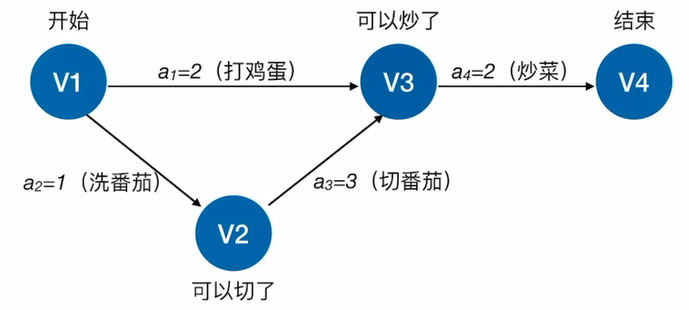
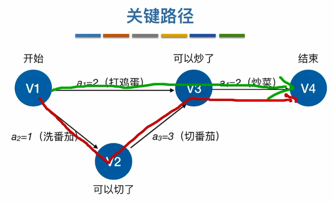
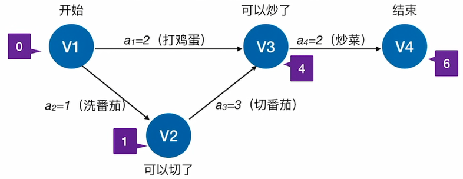

# 5.9 关键路径

## 5.9.1 AOE网

`AOE网`（Activity On Edge NetWork，用`边表示活动`的网）：
`带权有向图`中，`顶点表示事件`，`有向边表示活动`，`边上的权值表示完成该活动的开销`。

AOE网具有以下两个性质：

- ①只有在某顶点所代表的事件发生后，从该顶点出发的各有向边所代表的活动才能开始；
- ② 只有在进入某顶点的各有向边所代表的活动都已结束时，该顶点所代表的事件才能发生。
另外，有些活动是可以并行进行的

在AOE网中仅有一个入度为0的顶点，称为`开始顶点（源点）`，它表示整个工程的开始；
也仅有一个出度为0的顶点，称为`结束顶点（汇点）`，它表示整个工程的结束。

## 5.9.2 关键路径

`从源点到汇点`的`有向路径`可能有多条，所有路径中，具有`最大路径长度`的路径称为
`关键路径`，而把`关键路径上的活动`称为`关键活动`

`特性`：
- 若关键活动耗时增加，则整个工程的工期将增长
- 缩短关键活动的时间，可以缩短整个工程的工期
- 当缩短到一定程度时，关键活动可能会变成非关键活动

可能有多条关键路径，只提高一条关键路径上的关键活动速度并不能缩短整个工程的工期，只有加快那些包括在所有关键路径上的关键活动才能达到缩短工期的目的。

`计算`：
- 事件最早、最迟发生时间
- 活动最早、最迟开始时间
- 活动的时间余量=活动最迟开始-最早开始

