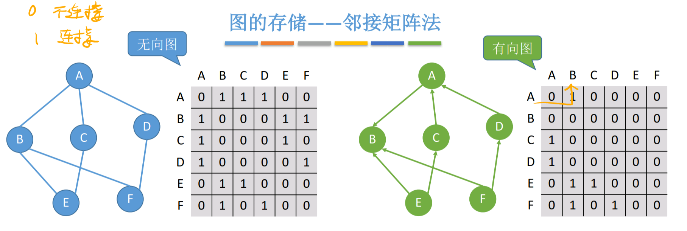
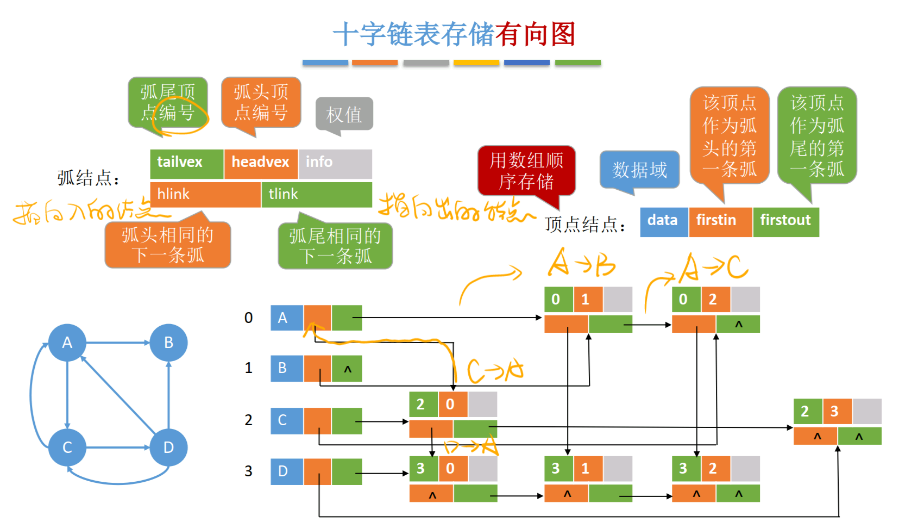
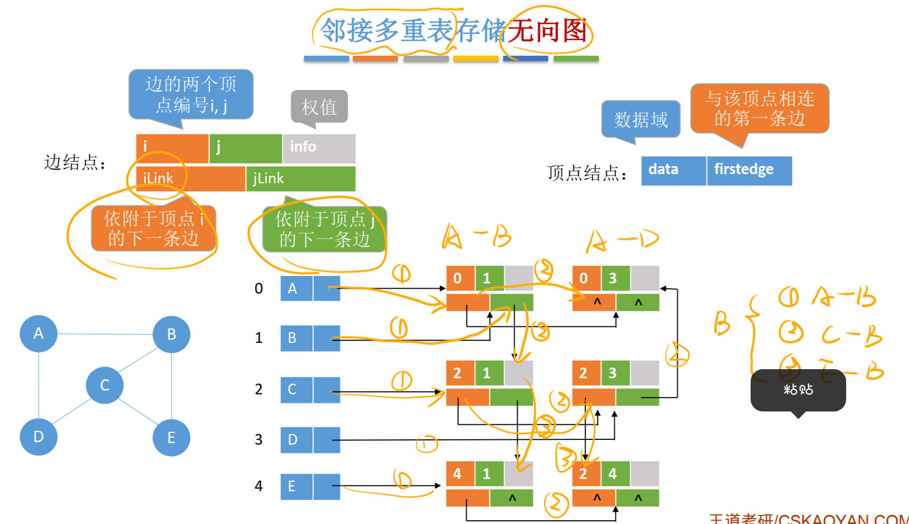

## 图的存储结构

### 一、图的存储结构

①领接矩阵：顺序存储（一维数组存点的数据，二维数组存边的连接情况）(存储无向图、有向图)
②邻接表：顺序+链式存储（顺序存点的数据，链存连接该点的边）（存储有向图、无向图）
③十字链表：链式存储（存储有向图）
④邻接多重表：链式存储（存储无向图）


### 二、邻接矩阵法

`空间复杂度`=$$O(|V|^2)$$，`适合存稠密图`

`无向图的邻接矩阵`是`对称矩阵`，可以`压缩存储`，见3.6

`性质`：$$A$$为图$$G$$的邻接矩阵，则$$A^n$$的元素$$A^n[i][j]$$=`顶点i到顶点j的长度为n的路径的数目`

`计算度、入度、出度`：必须遍历对应的行或列。
`找相邻的边`：必须遍历对应的行或列。

#### 1.1普通图的领接矩阵法：



```c
#define MaxVertexNum 100                 //顶点数目最大值
typedef struct{
    char Vex[MaxVertexNum];              //顶点表：存每个点的数据
    int Edge[MaxVertexNum][MaxVertexNum];//邻接矩阵，边表：存边的连接情况
    int vexnum, arcnum;                  //图当前的顶点数和边数（弧数）
}MGraph;
```

边可以是int，bool或枚举型变量。

#### 1.2普通图的度、入度、出度

某点的度：某点的边数

无向图：
`第i个结点的度`=`第i行(第i列)`的`非零元素`个数。

有向图：
`第i个结点的出度`=`第i行`的`非零元素`个数。
`第i个结点的入度`=`第i列`的`非零元素`个数。
`第i个结点的度`=`第i行、第i列`的`非零元素`个数`之和`。

求顶点的度、入度、出度的`时间复杂度`=O($$|V|$$)

#### 2.带权图的领接矩阵法


```c
#define MaxVertexNum 100                 //顶点数目最大值
#define INFINITY 4294967295              //宏定义常量“无穷”，4294967295为最大的int值
typedef char VertexType;                 //顶点的数据类型
typedef int EdgeType;                    //边的数据类型
typedef struct{
    VertexType Vex[MaxVertexNum];        //顶点表：存每个点的数据
    EdgeType Edge[MaxVertexNum][MaxVertexNum];//邻接矩阵，边表：存边的连接情况
    int vexnum, arcnum;                  //图当前的顶点数和边数（弧数）
}MGraph;
```

### 三、邻接表法

`空间复杂度`：无向图为$$O(|V|+2|E|)$$，有向图为$$O(|V|+|E|)$$，`适合存稀疏图`
`表示方式不唯一`

邻接矩阵降低了空间复杂度，但使操作不方便了：
`计算度、入度、出度`：计算有向图的度、入度不方便，其余很方便。
`找相邻的边`：找有向图的入边不方便。

#### 图的类型描述：

与树的孩子表示法很像


```c
#define MaxVertexNum 100       //顶点数目最大值
//"边（弧）"
typedef struct ArcNode{
    int adjvex;                //边（弧）指向那个结点
    struct ArcNode *next;      //指向下一条弧的指针
    //InfoType info;           //边权值
}ArcNode;
//"顶点"
typedef struct VNode{
    VertexType data;           //顶点数据
    ArcNode *first;            //顶点指向的第一条边
}VNode, AdjList[MaxVertexNum];
//用领接表存储图
typedef struct{
    AdjList vertices;          //顶点数组
    int vernum, arcnum;        ////图当前的顶点数和边数（弧数）
}ALGraph;
```

### 四、十字链表法

`空间复杂度`：$$O(|V|+|E|)$$，与邻接表法一样

解决了邻接表法的找入边难的问题。



### 五、邻接多重表

`空间复杂度`：$$O(|V|+|E|)$$，比邻接表法的$$O(|V|+2|E|)$$好

解决了邻接表法存两遍边的空间浪费。

删除边、删除结点等操作很方便。



