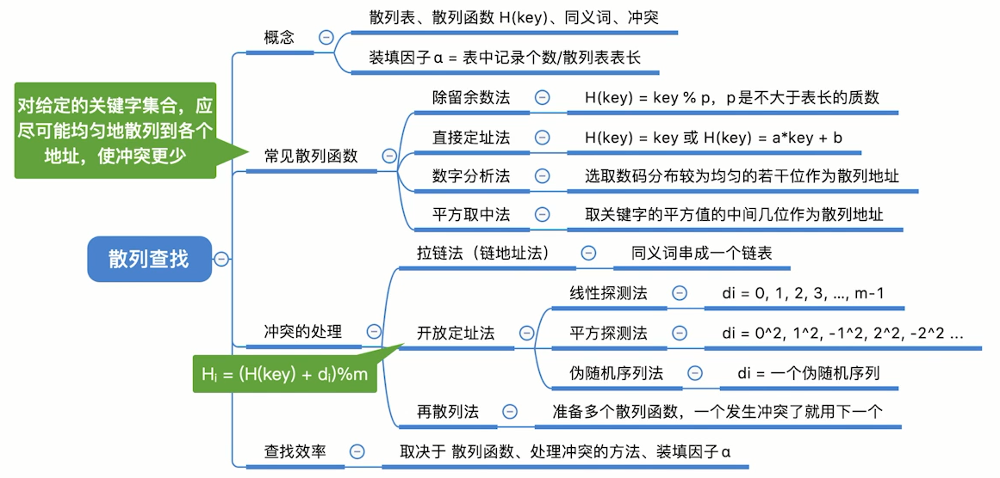
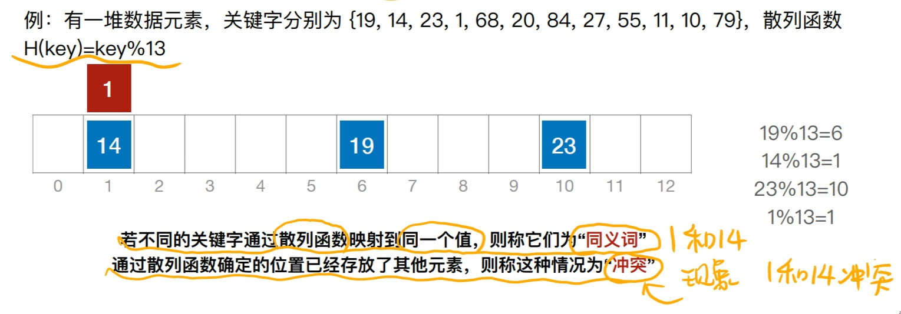
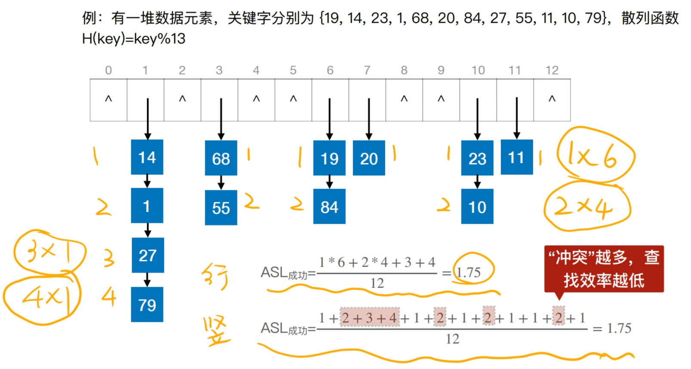
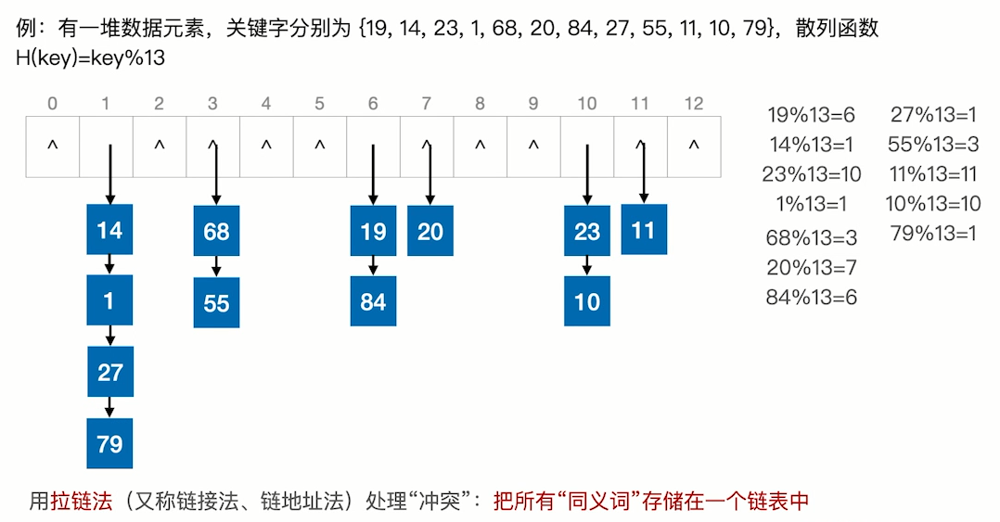
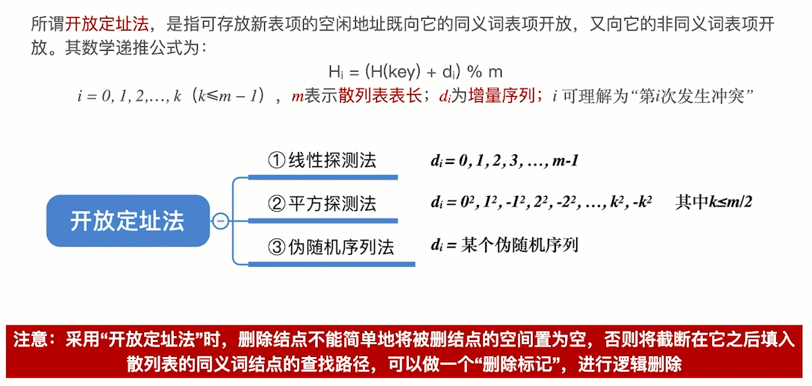
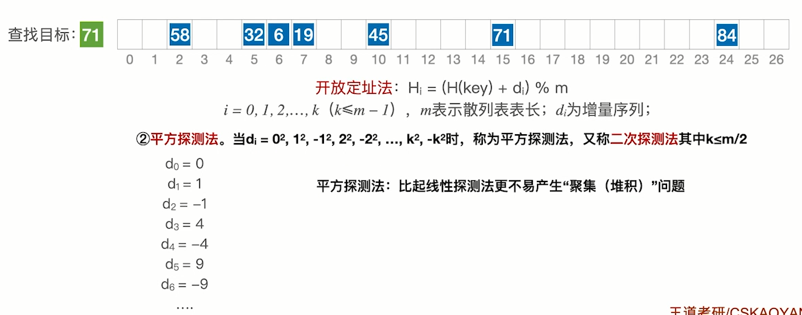

# 6.7 散列查找(哈希查找)

## 6.7.1 哈希查找的定义

`散列表`（Hash Table），又名`哈希表`，是一种数据结构。

`特点`：数据元素的`关键字与其存储地址直接相关`。

通过`散列函数（哈希函数）`将关键字与存储地址一一映射。

散列查找是典型的`“用空间换时间”的算法`

`装填因子α` = 表中记录个数/散列表表长

`查找效率`：取决于`散列函数`、`处理冲突的方法`、`装填因子α`

## 6.7.2 常见的散列函数（哈希函数）

冲突是由散列函数导致的，`冲突越多，查找效率越低`

散列函数的设计目的：让不同的关键字的冲突尽可能少。

- ①除留余数法
- ②直接定址法
- ③数字分析法
- ④平方取中法

### (1) 除留余数法

$$H(key)=key\mod{p}$$

除数p取法：散列表表长为m，取一个不大于m但最接近或等于m的`质数p`

查找方法：当p=13时，查找66，66%13=1，则在a[1]下的链表中寻找。

`查找效率分析`：

### (2)直接定址法

$$H(key)=key$$ 或 $$H(key)=a*key+b$$ 

这种计算最简单，适合`关键字分布连续`的情况

### (3)数字分析法

选取数码`分布较为均匀的若干位`作为散列地址。

### (4) 平方取中法

取`关键字的平方值的中间几位`作为散列地址。

具体取多少位要视实际情况而定。这种方法得到的`散列地址与关键字的每位都有关系`，因此使得散列地址分布比较均匀，适用于关键字的每位取值都不够均匀或均小于散列地址所需的位数。

##  6.7.3 处理冲突的方法

- ①拉链法
- ②开放定址法
- ③再散列法

处理冲突的方法：以拉链法为主。

### (1)拉链法

### (2)开放定址法

`d的不同取法`：

#### ①线性探测法

#### ②平方探测法

散列表长必须是$4j+3$

#### ③伪随机序列法

d取随机值

### (3)再散列法

