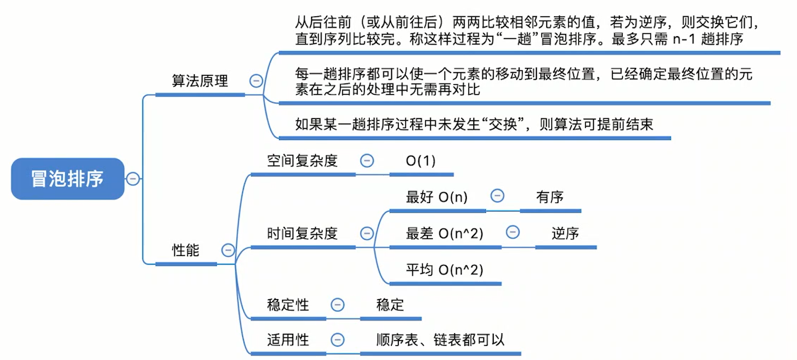

# 7.4 冒泡排序




`冒泡排序`是一种简单的排序算法。它重复地走访过要排序的数列，`一次比较两个元素`，如果它们的顺序错误就把它们交换过来。走访数列的工作是重复地进行直到没有再需要交换，也就是说该数列已经排序完成。这个算法的名字由来是因为`越小的元素会经由交换慢慢“浮”到数列的顶端`。 

`确定最小数或最大数的位置`

## 7.4.1 算法思想：

- 比较相邻的元素。如果第一个比第二个大，就交换它们两个；
- 对每一对相邻元素作同样的工作，从开始第一对到结尾的最后一对，这样在最后的元素应该会是最大的数；
- 针对所有的元素重复以上的步骤，除了最后一个；
- 重复步骤1~3，直到排序完成。


## 7.4.2 代码实现：

从后往前两两比较，逆序则交换，比较完可将最小的放前面，将第一个去除，比较剩下的，再确定次小，以此类推。

```c
//交换
void swap((int &a, int &b){
	int temp = a;
    a = b;
    b = temp;
}
//冒泡排序
void BubbleSort(int A[],int n){
    for(int i=0; i<n; i++){
        bool flag = false;
        for(int j=n-1; j>i; j--)     //一趟冒泡排序：从后往前两两比较
            if(A[j-1]>A[j]){         //若逆序
                swqp(A[j-1],A[j]);   //则交换
                flag = true;
            }
        if(flag == false){
            return;          //本趟遍历后没有发生交换，说明表已经有序
        }
    }
}
```

## 7.4.3 算法效率分析

`空间复杂度`=$O(1)$，因为需要的辅助变量为bool flag

时间复杂度:

- 最好情况=$n-1$，时间复杂度=$O(n)$
- 最坏情况=$(n-1)+(n-2)+\cdots+2+1=\frac{n(n-1)}{2}$，时间复杂度=$O(n^2)$
- 平均`时间复杂度`=$O(n^2)$

算法稳定性：`稳定`

顺序表和链表都可以。
