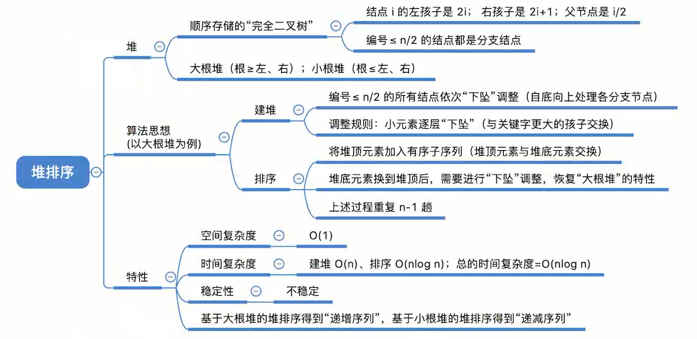

# 7.7 堆排序




`堆排序`是指利用堆这种数据结构所设计的一种排序算法。堆积是一个近似完全二叉树的结构，并同时满足堆积的性质：即子结点的键值或索引总是小于（或者大于）它的父节点。


大根堆：完全二叉树中，根>=左、右。

小根堆：完全二叉树中，根<=左、右。

## 7.7.1 算法思想：

- 将初始待排序关键字序列(R1,R2….Rn)构建成大顶堆，此堆为初始的无序区；
- 将堆顶元素R[1]与最后一个元素R[n]交换，此时得到新的无序区(R1,R2,……Rn-1)和新的有序区(Rn),且满足R[1,2…n-1]<=R[n]；
- 由于交换后新的堆顶R[1]可能违反堆的性质，因此需要对当前无序区(R1,R2,……Rn-1)调整为新堆，然后再次将R[1]与无序区最后一个元素交换，得到新的无序区(R1,R2….Rn-2)和新的有序区(Rn-1,Rn)。不断重复此过程直到有序区的元素个数为n-1，则整个排序过程完成。


## 7.7.2 代码实现：

### (1)先建立大根堆：

①建立大根堆，只需检查所有非终端结点是否满足大根堆要求。顺序存储的二叉树中非终端结点编号为$i<\lfloor n/2 \rfloor$
②从$i=\lfloor n/2 \rfloor$开始，从后往前处理非终端结点，判断第i个结点与它的孩子结点2i，2i+1是否满足大根堆要求。不满足，则根与最大的孩子互换。
③换了的孩子还要继续判断与它的孩子是否满足，依次往下判断。直到没有可以换的。（`小元素不断下坠`）

### (2)基于大根堆进行排序

- ①大根堆可知最前面是最大的，则交换最前与最后元素
- ②排除最后元素，重新建立大根堆，建好后再将第一个元素与最后一个元素交换（排除最后已确定的元素），以此类推。

```c
//建立大根堆（处理所有的非终端结点）(初始调整范围)
void BuildMaxHeap(int A[],int len){
    for(int i=len/2; i>0; i--){
        HeadAdjust(A,i,len);
    }
}
//将以k为根的子树调整为大根堆（调整方法：下坠）
void HeadAdjust(int A[],int k;int len){
    A[0]=A[k];                           //k指向根结点，用A[0]暂存
    for(int i=2*k; i<=len; i*=2){        //沿key较大的子结点下下筛选
        if(i<len && A[i]<A[i+1]) i++;    //右孩子更大，则i++
        if(A[0] >= A[i]) break;          //满足根>左、右孩子
        else{
            A[k] = A[i];                 //将大的孩子成为根
            k = i;                       //k指向新的根
        }
    }
    A[k] = A[0];                         //被筛选结点的值放入最终位置
}
//堆排序的完整逻辑
void HeapSort(int A[],int len){
    BuildMaxHeap(A,len);        //初始建立大根堆
    for(int i=len; i>1; i--){   //找n-1次最大元素
        swap(A[i],A[1]);        //堆顶元素与堆顶元素交换
    	HeadAdjust(A,1,i-1);    //交换后只有A[1]不满足大根堆要求，则调整A[1]即可
	}
}
```

## 7.7.3 算法效率分析

`空间复杂度`=$O(1)$

时间复杂度：

建堆：
- 一个结点，每下坠一层，最多只对比关键字两次。
- 树高为$h$，在i层的结点最多下坠$h-i$层，则对比关键字$2*(h-i)$
    - 第一层对比$2^0*2*(h-1)$
    - 第二层对比$2^1*2*(h-2)$
    - 则第i层对比$2^{i-1}*2*(h-i)$，共h-1层
- 求和后不超过$4n$，则`建堆的时间复杂度`=$O(n)$

下坠：
n-1次下坠，每次最多下h层，因$h=log_2n$，则`下坠的时间复杂度`=$O(nlog_2n)$

则堆排序的`时间复杂度`=$O(n)$+$O(nlog_2n)$=$O(nlog_2n)$

算法稳定性：`不稳定`
