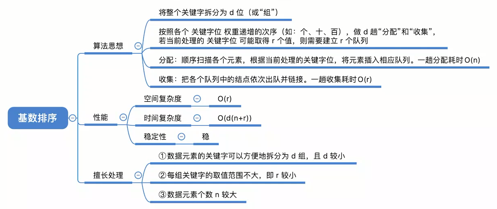
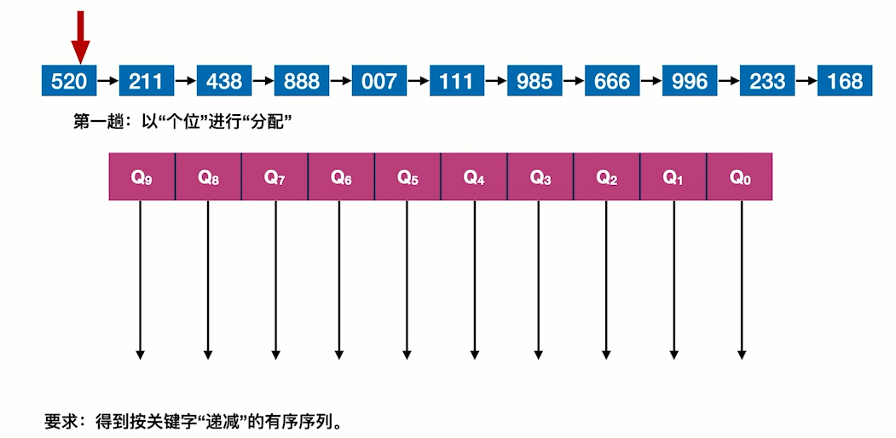
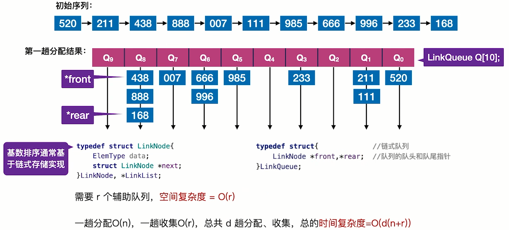

# 7.9 基数排序



`基数排序`是按照低位先排序，然后收集；再按照高位排序，然后再收集；依次类推，直到最高位。有时候有些属性是有优先级顺序的，先按低优先级排序，再按高优先级排序。最后的次序就是高优先级高的在前，高优先级相同的低优先级高的在前。

`r为基数`，基数是每一位可以取的数的范围，例如10进制的一位数可以取0~9，则`十进制的基数r=10`。

d为关键字个数，也是趟数，例如`10进制的一位数为一个d`。

n为元素个数

基数排序擅长树立d小，r小，n大的元素序列进行排序。



## 7.9.1 算法思想：

- 取得数组中的最大数，并取得位数；
- arr为原始数组，从最低位开始取每个位组成radix数组；
- 对radix进行计数排序（利用计数排序适用于小范围数的


## 7.9.2 代码实现：

需一个辅助链队列来实现



```c

```

## 7.9.3 算法效率分析

空间、时间复杂度`取决于基数r`

`空间复杂度`=$O(r)$， 
因为需要r个辅助队列，链队列是增加指针域，则每个链队列的空间复杂度=$O(1)$

`时间复杂度`=$O(d(n+r))$

算法稳定性：`稳定`

### 7.9.4 基数排序的应用


