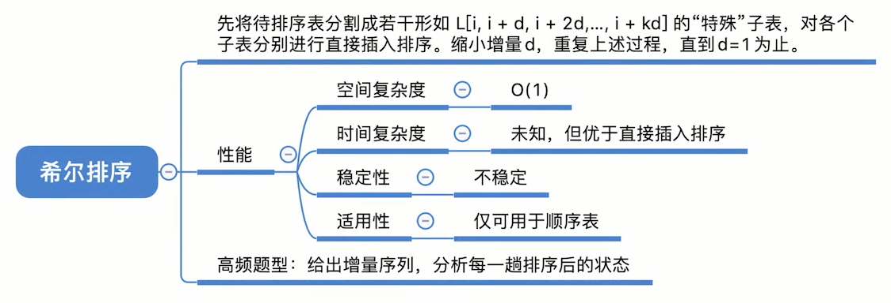
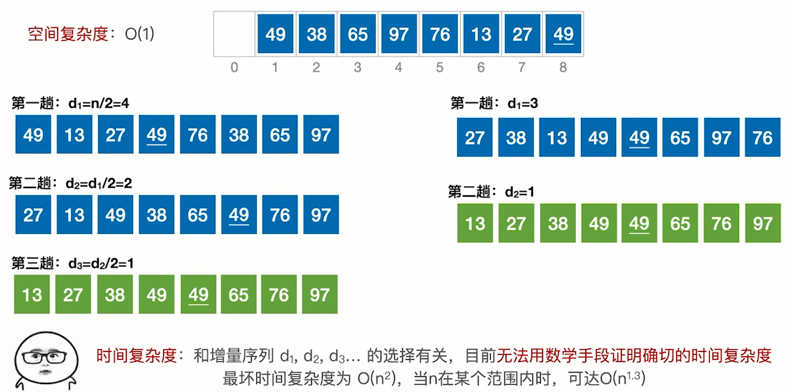

## 希尔排序——Shell's Sort



`希尔排序`又叫`缩小增量排序`。

1959年Shell发明，第一个突破$$O(n^2)$$的排序算法，是`简单插入排序的改进版`。它与插入排序的不同之处在于，它会`优先比较距离较远的元素`。

### 一、算法思想：

先将整个待排序的记录序列分割成为若干子序列分别进行直接插入排序，具体算法描述：

- 选择一个增量序列t1，t2，…，tk，其中ti>tj，tk=1；
- 按增量序列个数k，对序列进行k 趟排序；
- 每趟排序，根据对应的增量ti，将待排序列分割成若干长度为m 的子序列，分别对各子表进行直接插入排序。仅增量因子为1 时，整个序列作为一个表来处理，表长度即为整个序列的长度。


### 二、代码实现：

在简单插入排序外加了`步长变化`

```c
//希尔排序
void InsertSort(int A[], int n){
    int d, i, j;
    for(d=n/2; d>1; d=d/2){     //步长变化
        for(i=d+1; i<=n; ++i){  //讲个元素插入已排好的序列中
        if(A[i]<A[i-d]){        //若A[i]的关键字小于前驱
            A[0] = A[i];        //复制为哨兵，A[0]作为哨兵
            for(j=i-d; j>0 && A[0]<A[j]; j-=d){ //从后往前查找待插入位置
                A[j+d] = A[j];  //所有大于A[0]的都后移
            }
            A[j+d] = A[0];      //复制到插入位置
        }
    }
    }
}
```

### 三、算法效率分析

`空间复杂度`=$$O(1)$$，因为需要的辅助变量为int d，i，j，

时间复杂度:
无法计算，`时间复杂度`大概为=$$O(n^{1.3})$$

算法稳定性：`不稳定`

`仅适用于顺序表，不适用于链表`


